# TRRCMS - Entity Relationship Diagram

**Version:** 0.9.0  
**Last Updated:** January 10, 2026

---

## 📊 Entity Relationship Diagram

Below is the complete ERD showing all 17 entities and their relationships:

```mermaid
erDiagram
    %% ========================================
    %% TRRCMS - Entity Relationship Diagram
    %% Version: 0.9.0
    %% Last Updated: January 10, 2026
    %% ========================================

    %% ==================== CORE ENTITIES (IN DATABASE) ====================

    Users ||--o{ Claims : "creates/verifies/approves"
    Users ||--o{ Users : "supervises"
    Users ||--o{ BuildingAssignments : "receives assignments"
    Users ||--o{ Surveys : "conducts"
    Users ||--o{ Documents : "uploads"
    Users ||--o{ AuditLogs : "generates"

    Buildings ||--o{ PropertyUnits : "contains"
    Buildings ||--o{ BuildingAssignments : "assigned in"
    Buildings }o--|| Users : "created by"

    PropertyUnits ||--o{ PersonPropertyRelations : "has occupants"
    PropertyUnits ||--o{ Claims : "subject of"
    PropertyUnits }o--|| Buildings : "located in"
    PropertyUnits }o--|| Households : "occupied by"

    Persons ||--o{ PersonPropertyRelations : "occupies properties"
    Persons ||--o{ Claims : "primary claimant"
    Persons }o--o| Households : "member of"
    Persons ||--o{ Documents : "has documents"

    Households ||--o{ Persons : "has members"
    Households }o--|| PropertyUnits : "resides in"

    PersonPropertyRelations }o--|| Persons : "person"
    PersonPropertyRelations }o--|| PropertyUnits : "property"

    Claims }o--|| PropertyUnits : "for property"
    Claims }o--|| Persons : "primary claimant"
    Claims ||--o{ Evidences : "supported by"
    Claims ||--o{ Documents : "attached to"
    Claims }o--|| Users : "submitted by"
    Claims }o--o| Users : "assigned to"
    Claims }o--o| Users : "verified by"
    Claims }o--o| Users : "approved/rejected by"
    Claims }o--o| Certificates : "results in"
    Claims ||--o{ ConflictResolutions : "has conflicts"

    Evidences }o--|| Claims : "supports claim"
    Evidences }o--|| Persons : "belongs to"
    Evidences ||--o{ Documents : "has documents"

    Documents }o--|| Claims : "attached to claim"
    Documents }o--o| Evidences : "attached to evidence"
    Documents }o--o| Persons : "belongs to person"
    Documents }o--|| Users : "uploaded by"

    %% ==================== PLANNED ENTITIES (NOT YET IN DATABASE) ====================

    Certificates }o--|| Claims : "issued for"
    Certificates }o--|| Users : "issued by"

    Surveys }o--|| Users : "conducted by"
    Surveys }o--|| Buildings : "for building"
    Surveys }o--o| PropertyUnits : "for unit"
    Surveys ||--o{ Persons : "records persons"
    Surveys ||--o{ Households : "records households"

    BuildingAssignments }o--|| Buildings : "assigns building"
    BuildingAssignments }o--|| Users : "assigned to collector"
    BuildingAssignments }o--|| Users : "assigned by admin"

    ConflictResolutions }o--|| Claims : "resolves conflict"
    ConflictResolutions }o--|| Users : "resolved by"

    Vocabularies ||--o{ Vocabularies : "has versions"

    ImportPackages ||--o{ Claims : "imports"
    ImportPackages ||--o{ Persons : "imports"
    ImportPackages ||--o{ PropertyUnits : "imports"
    ImportPackages }o--|| Users : "imported by"

    AuditLogs }o--|| Users : "performed by"

    %% ==================== ENTITY DEFINITIONS ====================

    Users {
        uuid Id PK
        string Username UK "Unique, indexed"
        string Email UK "Unique, indexed"
        string PasswordHash
        string PasswordSalt
        string FullNameArabic
        string FullNameEnglish
        string EmployeeId
        string PhoneNumber
        string Organization
        string JobTitle
        int Role "Enum: Administrator, DataManager, etc."
        bool HasMobileAccess
        bool HasDesktopAccess
        bool IsActive
        bool IsLockedOut
        datetime LockoutEndDate
        int FailedLoginAttempts
        datetime LastLoginDate
        datetime LastPasswordChangeDate
        bool MustChangePassword
        string SecurityStamp
        string RefreshToken
        datetime RefreshTokenExpiryDate
        uuid SupervisorUserId FK "Self-referencing"
        string TeamName
        string AssignedTabletId
        datetime TabletAssignedDate
        string PreferredLanguage
        bool TwoFactorEnabled
    }

    Buildings {
        uuid Id PK
        string BuildingId UK "Format: GG-DD-SS-CCC-NNN-BBBBB"
        string GovernorateCode
        string DistrictCode
        string SubDistrictCode
        string CommunityCode
        string NeighborhoodCode
        string BuildingNumber
        string GovernorateName
        string DistrictName
        string SubDistrictName
        string CommunityName
        string NeighborhoodName
        int BuildingType "Enum"
        string StreetName
        string LocationDescription
        geometry Geometry "PostGIS"
        decimal Latitude
        decimal Longitude
        int Status "Enum"
        int DamageLevel "Enum"
        int NumberOfFloors
        int EstimatedUnits
        int YearBuilt
        string ConstructionMaterial
        string AccessibilityNotes
    }

    PropertyUnits {
        uuid Id PK
        string UnitIdentifier UK "Format: BuildingId-UnitNumber"
        uuid BuildingId FK
        string UnitNumber
        int FloorNumber
        int UnitType "Enum"
        decimal Area
        int NumberOfRooms
        int Status "Enum"
        int DamageLevel "Enum"
        string DamageDescription
        int OccupancyType "Enum"
        int OccupancyNature "Enum"
        uuid CurrentHouseholdId FK
        string OwnershipDocumentation
        string AccessibilityFeatures
    }

    Persons {
        uuid Id PK
        string FirstNameArabic
        string FatherNameArabic
        string FamilyNameArabic
        string MotherNameArabic
        string FirstNameEnglish
        string FamilyNameEnglish
        string FullNameArabic "Computed"
        string FullNameEnglish "Computed"
        string Gender
        date DateOfBirth
        int Age "Computed"
        string PlaceOfBirthArabic
        string NationalityArabic
        string MaritalStatus
        string EducationLevel
        string Occupation
        string NationalIdNumber UK
        string PassportNumber
        string CivilRegistryNumber
        string PhoneNumber
        string EmailAddress
        bool IsDeceased
        date DateOfDeath
        uuid CurrentHouseholdId FK
        string RelationshipToHead
    }

    Households {
        uuid Id PK
        string HouseholdCode UK
        uuid PropertyUnitId FK
        int Size "Number of members"
        int NumberOfAdults
        int NumberOfChildren
        int NumberOfElderly
        int NumberOfDisabled
        decimal MonthlyIncome
        string IncomeSource
        bool HasVulnerableMembers
        string VulnerabilityNotes
        bool ReceivesSocialAssistance
        string SocialAssistanceDetails
        bool HasDisplacedMembers
        string DisplacementDetails
    }

    PersonPropertyRelations {
        uuid Id PK
        uuid PersonId FK
        uuid PropertyUnitId FK
        string RelationType "Owner, Tenant, Occupant, etc."
        date StartDate
        date EndDate
        int OwnershipPercentage
        string DocumentationReference
        string Notes
    }

    Claims {
        uuid Id PK
        string ClaimNumber UK "Generated: CLM-YYYY-NNNNNN"
        uuid PropertyUnitId FK
        uuid PrimaryClaimantId FK
        string ClaimType
        int ClaimSource "Enum"
        int Priority "Enum"
        int LifecycleStage "Enum"
        int Status "Enum"
        datetime SubmittedDate
        uuid SubmittedByUserId FK
        datetime DecisionDate
        uuid DecisionByUserId FK
        uuid AssignedToUserId FK
        datetime AssignedDate
        datetime TargetCompletionDate
        int TenureContractType "Enum"
        int OwnershipShare "Percentage * 100"
        date TenureStartDate
        date TenureEndDate
        string ClaimDescription
        string LegalBasis
        string SupportingNarrative
        bool HasConflicts
        int ConflictCount
        string ConflictResolutionStatus
        int EvidenceCount
        bool AllRequiredDocumentsSubmitted
        string MissingDocuments
        int VerificationStatus "Enum"
        datetime VerificationDate
        uuid VerifiedByUserId FK
        string VerificationNotes
        string FinalDecision
        string DecisionReason
        string DecisionNotes
        int CertificateStatus "Enum"
        string ProcessingNotes
        string PublicRemarks
    }

    Evidences {
        uuid Id PK
        uuid ClaimId FK
        uuid PersonId FK
        string EvidenceType
        string Title
        string Description
        string PhysicalLocation
        bool IsAvailable
        date CollectionDate
        uuid CollectedByUserId FK
        string PreservationStatus
        date ExpiryDate
        string AuthenticityNotes
        string LegalRelevance
    }

    Documents {
        uuid Id PK
        uuid ClaimId FK
        uuid EvidenceId FK
        uuid PersonId FK
        string DocumentType "Enum"
        string DocumentNumber UK
        string Title
        string Description
        string FilePath
        string FileExtension
        long FileSizeBytes
        string MimeType
        string Checksum
        date IssueDate
        date ExpiryDate
        string IssuingAuthority
        int VerificationStatus "Enum"
        datetime VerificationDate
        uuid VerifiedByUserId FK
        string VerificationNotes
        uuid UploadedByUserId FK
    }

    Certificates {
        uuid Id PK
        string CertificateNumber UK
        uuid ClaimId FK
        int CertificateType "Enum"
        datetime IssueDate
        datetime ExpiryDate
        uuid IssuedByUserId FK
        int Status "Enum"
        string LegalNotes
        string Conditions
        bool IsRevoked
        datetime RevokedDate
        uuid RevokedByUserId FK
        string RevocationReason
    }

    Surveys {
        uuid Id PK
        string SurveyCode UK
        int SurveyType "Field or Office"
        uuid BuildingId FK
        uuid PropertyUnitId FK
        uuid ConductedByUserId FK
        datetime SurveyDate
        int Status "Draft, Finalized"
        string Notes
    }

    BuildingAssignments {
        uuid Id PK
        uuid BuildingId FK
        uuid AssignedToUserId FK "Field Collector"
        uuid AssignedByUserId FK "Administrator"
        datetime AssignmentDate
        datetime DueDate
        int Status "Enum"
        string Notes
    }

    ConflictResolutions {
        uuid Id PK
        uuid ClaimId FK
        string ConflictType
        string Description
        datetime IdentifiedDate
        uuid ResolvedByUserId FK
        datetime ResolutionDate
        string ResolutionMethod
        string ResolutionNotes
        int Status "Enum"
    }

    Vocabularies {
        uuid Id PK
        string VocabularyCode UK
        string NameArabic
        string NameEnglish
        string Category
        int Version
        bool IsActive
        datetime EffectiveDate
        uuid ParentVersionId FK "Self-referencing for versioning"
    }

    ImportPackages {
        uuid Id PK
        string PackageCode UK
        datetime ImportDate
        uuid ImportedByUserId FK
        string FilePath
        string Checksum
        int Status "Enum"
        string ValidationReport
        int RecordsImported
        int RecordsFailed
    }

    AuditLogs {
        uuid Id PK
        datetime Timestamp
        uuid UserId FK
        string Action
        string EntityType
        uuid EntityId
        string Changes "JSON"
        string DeviceId
        string IpAddress
    }
```

---

## 📋 Quick Summary

**Entities:** 17 total (9 implemented ✅, 8 planned ⏳)

**Implemented (in database):**
1. Users
2. Buildings
3. PropertyUnits
4. Persons
5. Households
6. PersonPropertyRelations
7. Claims
8. Evidences
9. Documents

**Planned (defined but not migrated):**
10. Certificates
11. Surveys
12. BuildingAssignments
13. ConflictResolutions
14. Vocabularies
15. ImportPackages
16. AuditLogs
17. Referrals

---

## 📖 Documentation

For complete entity specifications, business rules, and implementation details, see: **TRRCMS_ERD_Specification.md**
